# Spinup-Evaluation

This repository contains code for benchmarking the machine learning spin-up of ocean models. It is designed to pair with [Spinup-Forecast](https://github.com/m2lines/Spinup-Forecast), which provides the machine learning models for accelerating the spin-up process for NEMO/DINO. The goal of this evaluation is to assess the performance of the spin-up process in terms of stability and convergence.

Spinup-Evaluation was developed to assess the DINO configuration of ocean model NEMO with a set of dedicated physsics-based metrics, but new metrics can be added to metrics.py to make it compatible with any ocean model. See [Adding New Metrics](#adding-new-metrics) for details.


## Code Structure
The evaluation is performed using the `main.py` script, which calls a set of metrics defined in the `metrics.py` file. The results are saved in a .txt file.

```plaintext

├── pyproject.toml         # Build system and tool configuration (e.g. black, ruff)
├── README.md              # Project overview and usage
├── LICENSE                # Project license
└── spinup_eval/                   # Source code
    ├── metrics.py         # Metric calculation functions
    ├── utils.py           # General utilities used across the project
    └── main.py                # Entry point script
```

The API is as follows:

- `main.py`: The main script to run the evaluation.
- `src/metrics.py`: Contains the definitions of the metrics used for evaluation.
- `src/utils.py`: Contains utility functions for data processing and visualization.

`main.py` is the entry point for the evaluation process. It takes the following command-line arguments:
- `--restart`: Path to model restart file.
- `--mesh-mask`: The name of the mesh mask file.
- `--output` : The name of the output file where the metrics are stored. The default is `metric_results.txt`.


## Using Spinup Evaluation
This repo is a WIP and usage is subject to change. Figure 1 below shows how the evaluation procedure works in Spinup-Evaluation. The toolbox can be used on `restart` file as `grid` files from NEMO. The restart file is a unified version of individual restart files generated by the running NEMO after getting updated with the latest predicted states. The file(s) path is passed to the `main.py` file and it runs all the metrics defined in `metrics.py`. The metrics resulst are stored in the form of a `csv` file and is then compared to the metrics result of the true data. This comparison is done using statistical metrics like MAE, RMSE and z-score that gives an estimate of the deviation of forecasted spinup from true data.

<div align="center">
  
  <div><strong>Fig 1.</strong> Evaluation flow diagram</div>
</div>


The tool can be run using the command-line instructions provided in the `Command line scripts` section.


## Command line scripts

### Installing Spinup Evaluation
To install Spinup-Evaluation, clone the repository and create a virtual environment:
```bash
git clone https://github.com/m2lines/Spinup-Evaluation.git
cd Spinup-Evaluation
python -m venv venv
source venv/bin/activate  # On Windows use `venv\Scripts\activate`
```

Then, install the required packages:

```bash
pip install -e .
```
For a development install, some further steps are recommended:

```sh
cd Spinup-Evaluation

# Install optional dev dependencies
pip install -e .[dev]

# Configure pre-commit hooks
pre-commit install
```
### Running on Saved Restart File
To evaluate a state obtained from a checkpoint, run Spinup-Evaluation as follows.

```sh
python main.py \
  --restart <path-to-restart.nc> \
  --mesh-mask <path-to-mesh_mask.nc> \
  --output <path-to-output>
```

### Running on Predictions [TODO]
To evaluate a new spin-up state obtained using [Spinup-Forecast](https://github.com/m2lines/Spinup-Forecast) do the following:

* `--predictions`: The path to the directory containing the new `pred_[variable].npy` spin-up states from `Spinup-Forecast`.
    - pred_so.npy
    - pred_thetao.npy
    - pred_zos.npy

<!-- * `--mesh-mask` : Path to the `mesh_mask.nc` file. This file contains the grid information for the model.
* [Optional] The path to a reference spin-up state. This is used to compare the new spin-up state against a known good state. If not provided, the evaluation will only assess the new spin-up state.
* [Optional] The restart file from the NEMO/DINO model.
    i.e. `` -->

<!-- >  -->


## Adding New Metrics
To add new metrics to the evaluation, modify the `metrics.py` file. An example metric function is given below:

```python
def check_density(density: xarray.DataArray, epsilon: float = 1e-5):
    """
    Return the proportion of points not respecting the density decreasing constraint.

    The density should decrease with depth, so the difference between the density at
    a given depth and the density at the next depth should be negative.

    Parameters
    ----------
    density : xarray.DataArray
        DataArray (t, depth, lat, lon) with density value for each point of the
        grid.
    epsilon : float
        Threshold for the density difference. Default is 1e-5.

    Returns
    -------
    float
        Proportion of points not respecting density decreasing constraint
    """
    density = density.where(density != 0)
    diff = density - density.shift(depth=-1)
    return (
        (diff > epsilon).mean().data
    )
```

## Testing [TODO]

Tests are provided in the `tests` directory. To run the tests, use the following command:

```bash
pytest tests/
```

## Restarting NEMO/DINO [TODO]

When running the metrics on updated predictions, you can also provide the `--restart` flag to the `main.py` script, referencing the old restart file. This will provide an updated restart in a format that can be used for restarting the model, prepended with "NEW".

See this Github Gist for more information on steps involved https://gist.github.com/ma595/bf2b977593171d7e2cd840dd4b452ead

See [Spinup-Forecast](https://github.com/m2lines/Spinup-Forecast) for generating spin-up predictions used as input here.


## Acknowledgements

This work builds on significant contributions by [Etienne Meunier](https://github.com/Etienne-Meunier), whose efforts on the [Metrics-Ocean](https://github.com/Etienne-Meunier/Metrics-Ocean) repository laid the foundation for several components used here.
