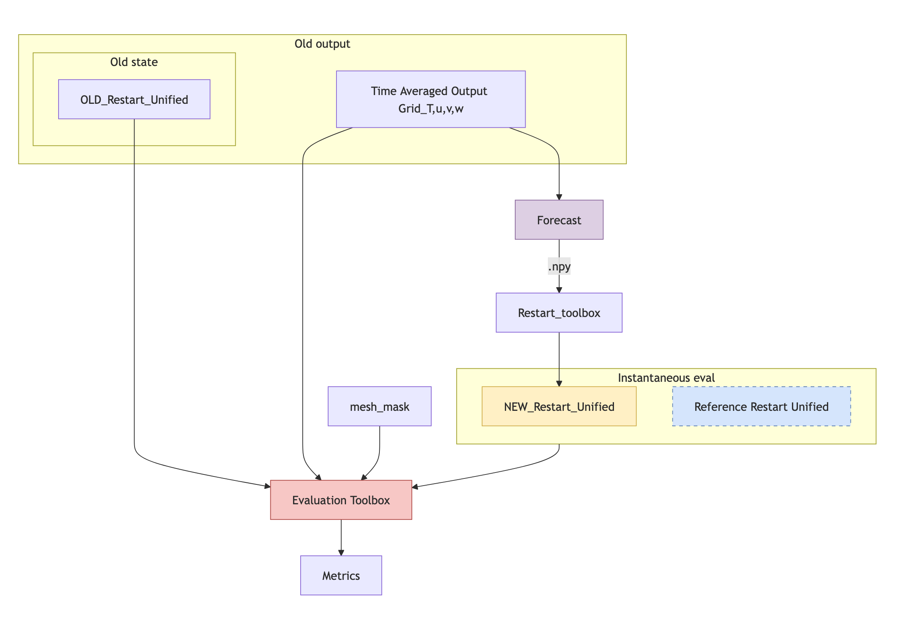

# Spinup-Evaluation

This repository contains code for benchmarking the machine learning spin-up of ocean models. It is designed to pair with [Spinup-Forecast](https://github.com/m2lines/Spinup-Forecast), which provides the machine learning models for accelerating the spin-up process for NEMO/DINO. The goal of this evaluation is to assess the performance of the spin-up process in terms of stability and convergence.

The evaluation is performed using the `main.py` script, which calls a set of metrics defined in the `metrics.py` file. The results are saved in a .txt file.

The API is as follows:

- `main.py`: The main script to run the evaluation.
- `src/metrics.py`: Contains the definitions of the metrics used for evaluation.
- `src/utils.py`: Contains utility functions for data processing and visualization.

<!-- ```plaintext
.
├── main.py                # Entry point script
├── pyproject.toml         # Build system and tool configuration (e.g. black, ruff)
├── README.md              # Project overview and usage
├── LICENSE                # Project license
└── src/                   # Source code
    ├── metrics.py         # Metric calculation functions
    └── utils.py           # General utilities used across the project
``` -->

`main.py` is the entry point for the evaluation process. It takes the following command-line arguments:
- `--restart`: Path to model restart file.
- `--mesh-mask`: The name of the mesh mask file.
- `--output` : The name of the output file where the metrics are stored. The default is `metric_results.txt`.

## Usage [TODO]
This repo is a WIP and usage is subject to change. Figure 1 below shows how the evaluation procedure works in Spinup-Evaluation.

<p align="center">

<figcaption>Fig 1. Evaluation flow diagram. </figcaption>
</p>

Spinup-Evaluation was developed to assess the DINO configuration of NEMO, but new metrics can be added to metrics.py to make it compatible with any ocean model. See [Adding New Metrics](#adding-new-metrics) for details.

### Running on instantaneous output (Saved Restart File)
To evaluate a state obtained from a checkpoint, run Spinup-Evaluation as follows. This could be from a state from the Ocean Model (NEMO, for example) or the "Forecasted state" obtained from [Spinup-Forecast](https://github.com/m2lines/Spinup-Forecast) after passing through the [Restart toolbox](https://github.com/m2lines/Spinup-Restart). Pass a reference restart file to compare against the new spin-up state. For other Ocean models ..

```sh
python main.py \
  --restart <path-to-restart.nc> \
  --mesh-mask <path-to-mesh_mask.nc> \
  --output <path-to-output> \
  --reference <path-to-reference-restart>
```

### Running on time averaged state (Grid_{T,u,v} states)
To evaluate a new spin-up state obtained using [Spinup-Forecast](https://github.com/m2lines/Spinup-Forecast) we do the following. This only applies to the old Grid state obtained from th Ocean model (NEMO for example). Pass the path to reference Grid_* files containing the u, v, and T fields. The reference grid files are used to compare against the spin-up state after ocean model correction.

```sh
python main.py \
  --restart <path-to-restart.nc> \
  --mesh-mask <path-to-mesh_mask.nc> \
  --output <path-to-output>
  --reference <path-to-reference-grid-{u,v,T}>
```
<!-- * `--mesh-mask` : Path to the `mesh_mask.nc` file. This file contains the grid information for the model.
* [Optional] The path to a reference spin-up state. This is used to compare the new spin-up state against a known good state. If not provided, the evaluation will only assess the new spin-up state.
* [Optional] The restart file from the NEMO/DINO model.
    i.e. `` -->

<!-- >  -->

## Installation
To install Spinup-Evaluation, clone the repository and create a virtual environment:
```bash
git clone https://github.com/m2lines/Spinup-Evaluation.git
cd Spinup-Evaluation
python -m venv venv
source venv/bin/activate  # On Windows use `venv\Scripts\activate`
```

Then, install the required packages:

```bash
pip install -e .
```
For a development install, some further steps are recommended:

```sh
cd Spinup-Evaluation

# Install optional dev dependencies
pip install -e .[dev]

# Configure pre-commit hooks
pre-commit install
```


## Adding New Metrics [TODO]
To add new metrics to the evaluation, modify the `metrics.py` file. Further guidance will be provided in the future.

## Testing [TODO]

Tests are provided in the `tests` directory. To run the tests, use the following command:

```bash
pytest tests/
```

## Restarting NEMO/DINO [TODO]

When running the metrics on updated predictions, you can also provide the `--restart` flag to the `main.py` script, referencing the old restart file. This will provide an updated restart in a format that can be used for restarting the model, prepended with "NEW".

See this Github Gist for more information on steps involved https://gist.github.com/ma595/bf2b977593171d7e2cd840dd4b452ead

See [Spinup-Forecast](https://github.com/m2lines/Spinup-Forecast) for generating spin-up predictions used as input here.


## Acknowledgements

This work builds on significant contributions by [Etienne Meunier](https://github.com/Etienne-Meunier), whose efforts on the [Metrics-Ocean](https://github.com/Etienne-Meunier/Metrics-Ocean) repository laid the foundation for several components used here.
