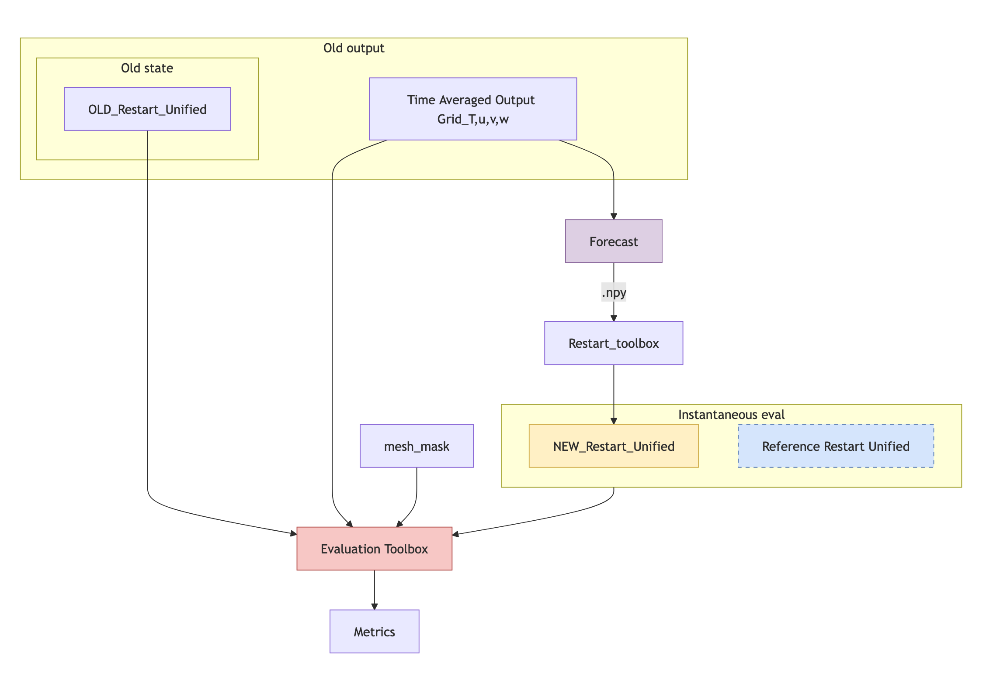

"""This page is dedicated to explaining the evaluation process and metrics."""

## Evaluation

Spinup-Evaluation is designed to assess the quality and stability of ocean model spin-up and restart states, as well as time-averaged outputs. The evaluation workflow is flexible: you can analyse a single simulation, or compare a simulation against a reference (e.g., a previous spin-up, a control run, or a forecast). The tool supports both instantaneous (restart) and time-averaged (output) evaluation modes.

The diagram below (Figure 1) illustrates the typical evaluation procedure. Model output files (restart and/or time-averaged NetCDFs) are loaded and standardized according to the YAML config. Metrics are computed, and—if a reference is provided—differences, MAE, and RMSE are calculated.

Spinup-Evaluation is often used alongside [spinup-forecast](https://github.com/m2lines/nemo-spinup-forecast), which automates the generation of machine learned spin-up states for NEMO/DINO models. Together, these tools provide a robust workflow for accelerating ocean spin-up.

<figcaption>Fig 1. Evaluation flow diagram illustrating the coupling to spinup-forecast, but spinup-evaluation can in theory be used to evaluate any ocean model, be it ML data driven, numerical or otherwise. </figcaption>

